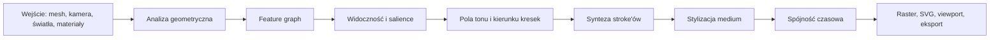
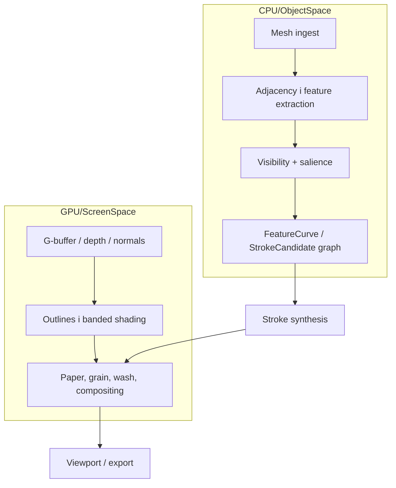
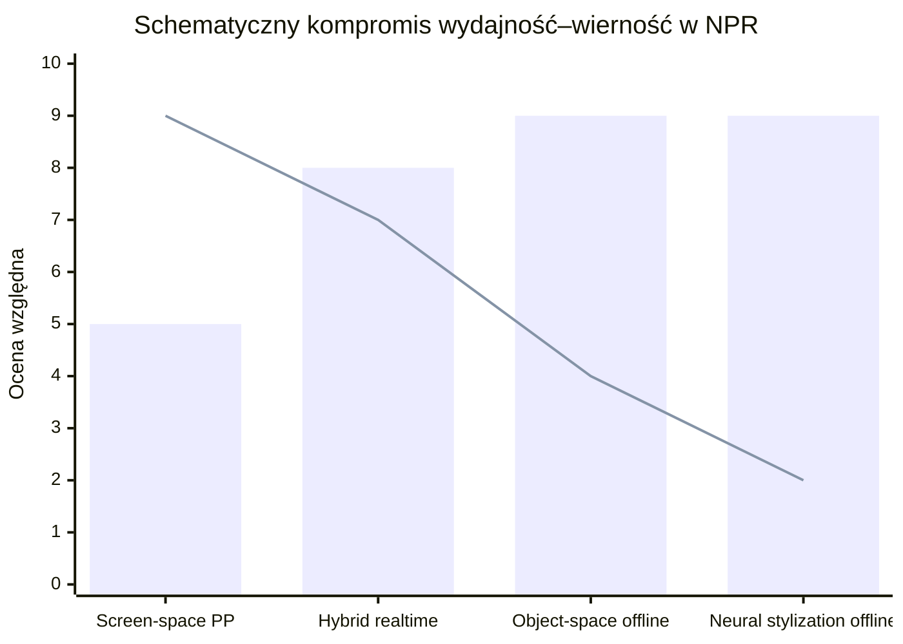

# Projekt kompleksowego dokumentu o implementacji NPR wiernie odtwarzającego rysunkowy charakter

## Streszczenie wykonawcze

Jeśli celem jest około pięćdziesięciostronicowy dokument po polsku, który ma jednocześnie tłumaczyć teorię i prowadzić do implementacji, to najlepsza struktura nie polega na opisie „efektów wizualnych” jeden po drugim, ale na zbudowaniu wspólnego rdzenia: **analiza geometrii i widoczności → pola percepcyjne → kandydaci na kreski → gramatyka stylu → finalne mark-making**. Dokładnie ten kierunek sugerują zarówno dostarczone notatki teoretyczne, jak i stan kodu: mesh ma być traktowany jako źródło dowodów geometrycznych, a nie jako gotowy rysunek; obecna implementacja posiada już szkic takiego pipeline’u, ale wciąż jest na poziomie bazowym dla feature lines, hatchingu i ukrywania linii. fileciteturn0file0 fileciteturn0file1

Najmocniejszy fundament bibliograficzny dla takiego dokumentu stanowią klasyczne prace NPR i line drawing from 3D: Haeberli oraz Saito–Takahashi jako źródła historyczne, Winkenbach–Salesin i Salisbury et al. dla pen-and-ink, Gooch et al. dla technicznej czytelności i stylizowanego shadingu, DeCarlo et al. dla suggestive contours, Judd et al. dla apparent ridges, Praun et al. dla real-time hatching i tonal art maps, a Bénard–Hertzmann jako syntetyczny tutorial o konturach, widoczności, stylizacji i animacji z modeli 3D. Klasyczne monografie Goochów oraz Strothottego i Schlechtwega nadal pozostają dobrym szkieletem pojęciowym. citeturn45search8turn33view0turn34view0turn37view0turn50view0turn11search9turn8search4

Na podstawie załączonego kodu można stwierdzić, że obecny system jest **eksperymentalnym silnikiem .NET 10 w C#**, z modułami AOT-friendly, desktopowym hostem Avalonia, wejściem OBJ, prostym presetem szkicowym, ekstrakcją boundary/silhouette/crease, sample-based hatchingiem, deterministycznym pruningiem, przybliżonym hidden-line filteringiem i końcowym `StrokeFrame` do renderowania w viewportcie. Nie widać jednak jeszcze pełnej abstrakcji `FeatureCurve`, dokładnego dzielenia krzywych na odcinki widoczne i zasłonięte, krzywiznowo sterowanego rozmieszczenia kresek, bufora historii dla animacji, eksportera SVG ani backendu shaderowego/GPU; te elementy należy w dokumencie wyraźnie oznaczyć jako **nieokreślone lub niezaimplementowane w dostarczonym materiale**. fileciteturn0file1 fileciteturn0file0

W praktyce dokument powinien doprowadzić do dwóch docelowych architektur. Pierwsza to **pipeline offline lub hybrydowy object-space**, niezbędny dla rysunku technicznego, pen-and-ink, SVG i wysokiej wierności konturów. Druga to **pipeline real-time GPU/screen-space lub deferred/hybrid**, konieczny dla Unity, Unreal i interaktywnej stylizacji, z użyciem G-bufferów, custom passów i post-processingu. Najlepszy system wielostylowy nie wybiera jednego z tych światów, tylko łączy je: linie semantyczne i widoczność liczy w object-space, a tonalność, tekstury, wash, paper grain i część stylizacji wykonuje na GPU. citeturn37view0turn50view0turn17view1turn21view1turn22view0

## Materiał wejściowy i założenia

Dostarczone notatki teoretyczne formułują bardzo dojrzałe założenie metodologiczne: renderer NPR ma przekształcać model 3D w decyzje rysunkowe, a dokument powinien rozróżniać trzy poziomy wierności — geometryczną, percepcyjną i stylową. Notatki wskazują też wymagane pojęcia, których obecny kod jeszcze nie domyka: `FeatureCurve`, częściowa widoczność wzdłuż krzywej, model salience, `ToneField`, `HatchingField`, bogatsze właściwości stroke’u oraz pełniejszą gramatykę stylu. To bardzo dobry punkt wyjścia dla dokumentu teoretyczno-implementacyjnego, bo pozwala od razu opisać nie tylko „jak rysować”, ale **co jest źródłem każdej kreski**. fileciteturn0file0

Kod źródłowy potwierdza, że ta koncepcja ma już pierwszą implementację. Z materiału wynika obecność AOT-friendly modułów `src/aot`, hosta `src/runtime/STFU.App`, desktopowego UI w Avalonia, loadera OBJ, pipeline’u NPR z presetami oraz path-based output. Sam preset szkicowy składa pipeline z kroków: projekcji meshy, budowy trójkątów projekcyjnych i topologii, ekstrakcji feature lines, budowy surface samples, lines of flow, hatchingu, przybliżonej occlusion, pruningu, budowy stroke candidates, stylizacji, humanizacji i końcowego `StrokeFrame`. fileciteturn0file1

W obecnym stanie materiałów część wymagań użytkownika pozostaje **nieokreślona**. Nie ma jednoznacznie określonych: docelowych platform poza desktopowym hostem Avalonia, formalnego rozróżnienia real-time kontra offline jako wymogu produktu, wsparcia animacji z historią międzyklatkową, zestawu formatów eksportu poza aktualnym `StrokeFrame` i wejściowym OBJ, implementacji shaderów GPU, ani adapterów do Unreal/Unity/Blender. Dokument powinien te braki nazwać wprost i dla każdego podać warianty implementacyjne zamiast sugerować, że są już obecne. fileciteturn0file1

Dla dokumentu około pięćdziesięciu stron rekomenduję następujący rozkład objętości:

| Część dokumentu | Cel | Sugerowana objętość |
|---|---|---:|
| Wprowadzenie i executive summary | zakres, definicje, założenia | 3–4 s. |
| Fundamenty NPR | historia, percepcja, klasyfikacja metod | 5–6 s. |
| Geometria i krzywe cech | kontury, silhouette, visibility, suggestive contours, ridges | 8–9 s. |
| Tone, hatching i synteza tekstur | tonal art maps, texture synthesis, shading | 7–8 s. |
| Stroke language i style grammar | pen, pencil, brush, watercolor, comic, technical | 8–9 s. |
| Implementacja CPU/GPU | pipeline, data structures, pseudocode, shader paths | 8–9 s. |
| Integracja z silnikami | Unity, Unreal, Blender, IO/export | 4–5 s. |
| Ewaluacja i ograniczenia | metryki, user studies, benchmarking | 4–5 s. |

Ten układ dobrze odpowiada zarówno klasycznej literaturze NPR, jak i strukturze obecnych notatek i kodu. fileciteturn0file0 fileciteturn0file1 citeturn50view0turn37view0

## Fundamenty NPR dla docelowego dokumentu

Rdzeń dokumentu powinien opierać się na tezie, że „ręczność” nie wynika z jednego filtra, tylko z kontrolowanej kombinacji: wyboru cech geometrycznych, uproszczenia percepcyjnego, nieregularności stroke’u oraz medium-specific texture cues. Klasyczne NPR rozwijało się właśnie w takim kierunku: od wczesnych systemów instrukcyjnego i malarskiego upraszczania obrazu, przez pen-and-ink i painterly rendering, aż po technikę linii zależnych od widoku, hatching w czasie rzeczywistym i współczesne systemy neuronowe do transferu stylu. citeturn45search8turn50view0turn5academia1

W części teoretycznej warto wyraźnie rozdzielić trzy rodziny metod. **Metody object-space** pracują na geometrii, są najważniejsze dla silhouette, occluding contours, crease, suggestive contours i apparent ridges. **Metody screen-space** pracują na buforach obrazu lub G-bufferach, są szybkie i wygodne, ale trudniej w nich utrzymać semantyczną stabilność i wysoką wiarygodność linii. **Metody hybrydowe** łączą oba światy: cechy strukturalne liczą na modelu, a stylizację tonu, tekstury i post-processing realizują w ekranie. Dokładnie takie kompromisy opisują zarówno tutorial Bénarda i Hertzmanna, jak i klasyczna praca o real-time hatchingu Prauna et al. citeturn50view0turn37view0

Dla rozdziału o percepcji warto wprost wykorzystać argument z literatury, że linie nie są prostym „ekwiwalentem krawędzi” z obrazu; działają dlatego, że odwołują się do elastycznych wnioskowań widza o kształcie, widoczności i strukturze powierzchni. To uzasadnia, czemu dobry NPR potrzebuje modelu salience i wyboru, a nie tylko pełnej enumeracji cech. citeturn3academia1turn33view0

Poniższy diagram dobrze nadaje się do umieszczenia na początku docelowego dokumentu jako nadrzędna architektura pojęciowa:



Ten przepływ jest spójny zarówno z załączonym dokumentem teorii, jak i z klasycznym NPR opartym o feature curves, tonal art maps i stylizowane stroke’y. fileciteturn0file0 citeturn37view0turn50view0

## Algorytmy i struktury danych

### Kontury, silhouette i krzywe opisujące formę

Najprostszy i nadal bardzo użyteczny wariant ekstrakcji linii na siatce trójkątów polega na klasyfikowaniu krawędzi topologicznych: boundary, silhouette i crease. Obecny kod dokładnie tak robi — boundary dla otwartej krawędzi, silhouette dla przeciwnego front/back-facing stanu trójkątów sąsiednich i crease dla przekroczenia progu kąta między normalnymi. To jest poprawny i sensowny pierwszy etap, ale nie wystarcza do „wiernego, ręcznego” feelingu w wielu stylach, bo nie obejmuje linii quasi-konturowych, krzywiznowo sterowanych i częściowo widocznych. fileciteturn0file1 fileciteturn0file0

Dalej dokument powinien przechodzić do **suggestive contours** i **apparent ridges**. DeCarlo et al. definiują suggestive contours jako rozszerzenie konturów dla pobliskich punktów widzenia, tak by lepiej komunikować formę zanim linia stanie się rzeczywistą silhouette; autorzy podkreślają też, że wymaga to dobrych estymat krzywizny i pochodnych krzywizny, a implementacja jest wrażliwa na szum i słabą teselację. Judd et al. pokazują z kolei, że apparent ridges można zdefiniować jako maksima krzywizny zależnej od widoku i że takie linie często obejmują lub wzmacniają inne rodzaje feature lines. To są algorytmy obowiązkowe, jeśli dokument ma obejmować szkic ekspresyjny, ołówek i wysokiej jakości line drawings. citeturn33view0turn34view0

Równolegle warto opisać, że na gładkich powierzchniach sama widoczność konturów jest trudnym problemem numerycznym. Nowsze prace nad subdivision surfaces i gładkimi occluding contours pokazują, że poprawna widoczność gładkich konturów jest nadal tematem aktywnym badawczo; praktycznie oznacza to, że produkcyjny dokument powinien przewidywać dwa tory implementacji: dokładny tor offline oraz szybszy, bardziej heurystyczny tor real-time. citeturn10academia0turn1academia0

Minimalny pseudokod dla klasyfikacji bazowych linii może wyglądać tak:

```text
for each topological_edge e:
    triA, triB = adjacent_triangles(e)

    if e.is_boundary:
        emit FeatureLine(type=Boundary)

    else if frontFacing(triA) XOR frontFacing(triB):
        emit FeatureLine(type=Silhouette)

    else if normalAngle(triA, triB) >= creaseThreshold
         and frontFacing(triA) and frontFacing(triB):
        emit FeatureLine(type=Crease)

optional:
    if suggestiveContourCondition(surfacePoint, view):
        emit FeatureCurve(type=SuggestiveContour)

    if apparentRidgeMaximum(surfacePoint, view):
        emit FeatureCurve(type=ApparentRidge)
```

Ten szkic jest zgodny z obecną implementacją bazową oraz z literaturą rozwijającą ją w stronę linii wyższego rzędu. fileciteturn0file1 citeturn33view0turn34view0

### Widoczność, hidden-line removal i spójność czasowa

Załączone notatki trafnie wskazują, że poprawny rysunek nie powinien pokazywać wszystkich linii tylnych i zasłoniętych, a jeszcze lepiej — powinien rozcinać krzywe na odcinki widoczne i ukryte. Obecny kod używa tu przybliżenia punktowego: sprawdza początek, środek i koniec odcinka wobec rzutowanych trójkątów front-facing z biasem głębokości. To jest dobre jako etap minimalistyczny, lecz zbyt słabe dla rysunku technicznego, blueprintów i animacji z dużą zmianą widoku. W dokumencie trzeba więc rozróżnić **przybliżoną filtrację linii** od **dokładnego visibility splittingu**. fileciteturn0file0 fileciteturn0file1

W animacji kluczowa jest spójność w czasie. Praun et al. pokazują, że niezależne rozmieszczanie stroke’ów per frame prowadzi do migotania, a czysto screen-space coherent strokes grożą „shower-door effect”. Dlatego ich system wybiera object-space coherence i rozwiązuje problem stałej szerokości linii przez tonal art maps i mipmapową organizację stroke’ów. Ten argument powinien być w dokumencie centralny, bo dotyczy nie tylko hatchingu, ale całego systemu temporal coherence. citeturn37view0

W praktycznej architekturze warto opisać trzy warstwy spójności czasowej: stabilne identyfikatory cech, historia stroke’ów oraz re-projekcja/historia ekranu. Co ważne, obecny kod już używa deterministycznych hashy od seeda i `StableId`, zarówno do pruningu, jak i do humanizacji kreski; to jest bardzo dobry fundament pod późniejsze temporal matching, nawet jeśli pełny bufor historii nie jest jeszcze jawnie obecny. fileciteturn0file1

### Tone, hatching, cross-hatching i synteza tekstur

Hatching to najważniejszy most między geometrią a stylem ręcznym. W klasycznej pracy o real-time hatchingu pokazano, że hatch strokes równocześnie komunikują materiał, ton i formę, a nie są tylko „dekoracją cienia”. Autorzy rozwiązują problem temporal i scale coherence przez **tonal art maps**, czyli strukturę obrazów hatchu zagnieżdżonych zarazem po tonie i po poziomie mip. Strokes z jaśniejszych obrazów są podzbiorami ciemniejszych, a strokes z grubszego mip-levelu są podzbiorami tych z dokładniejszego. To właśnie powinien opisywać rozdział o multi-scale NPR. citeturn37view0

Dostarczony kod ma obecnie sample-based hatching: rysuje odcinki o długości zależnej od cienia, z jednym dominującym kątem i jitterem. To jest wystarczające jako prototyp, ale niewystarczające dla cross-hatchingu, ołówka, technicznej kreski i akwareli. W docelowej implementacji trzeba rozdzielić przynajmniej cztery poziomy: `ToneField`, `DirectionField`, `DensityField` i `TextureField`. Kierunek kreski powinien pochodzić z principal curvature, kierunku pociągnięcia stylu, UV albo ręcznie wybranej field texture; gęstość — z tonu, salience i odległości; tekstura — z papieru, ziarna, suchego pędzla lub screentone’u. fileciteturn0file0 fileciteturn0file1 citeturn37view0

W praktyce proponowałbym następującą hierarchię: dla tonu jasnego tylko primary hatch; dla średniego tonu secondary hatch o kącie zależnym od stylu; dla tonu ciemnego tertiary hatch albo tonal mass. Dla komiksu i mangi warto dodać screentone i pattern masks; dla akwareli — plamy wash i granulation; dla ołówka — ziarnisty field i lokalne bundle stroki. Część tych efektów jest klasycznie proceduralna, część może być sample-based lub neural-assisted; dokument powinien pokazać, że wszystkie te style korzystają z tego samego rdzenia pól, ale różnią się mapowaniem na medium. citeturn37view0turn11academia3turn8academia6

### Zalecane struktury danych

Aktualny `NprGraph` przechowuje listy `ProjectedMesh`, `ProjectedVertex`, `ProjectedTriangle`, `TopologyEdge`, `SurfaceSample`, `FeatureLine` i `NprStroke`. To jest zaskakująco dobry szkielet pod dokument implementacyjny, bo jasno rozdziela analizę geometrii od końcowego renderu stroke’ów. Wersja docelowa powinna rozszerzyć ten graf o `FeatureCurve`, `VisibilitySegment`, `StrokeCluster`, `FrameHistory` i opcjonalnie `StyleMask`/`MaterialRegion`. Dla większych scen warto rozważyć half-edge mesh w warstwie analizy oraz BVH lub tile grid dla testów zasłonięcia i zagęszczenia. fileciteturn0file1

Porównanie rodzin technik warto zamknąć jedną tabelą syntetyczną:

| Rodzina technik | Dane wejściowe | Zalety | Wady | Najlepsze style |
|---|---|---|---|---|
| Object-space line extraction | mesh, adjacency, krzywizna, kamera | semantycznie poprawne silhouette i feature curves; dobry eksport wektorowy | trudniejsza widoczność i większy koszt CPU | technical drawing, pen-and-ink, blueprint |
| Screen-space edge detection | depth, normals, color, G-buffer | bardzo szybkie; dobre do real-time | słabsza semantyka, podatność na aliasing i TAA artefacts | comic/cartoon, szybki sketch, stylizowany viewport |
| Hybrid object + screen | feature graph + post-process | najlepszy kompromis jakości i wydajności | większa złożoność architektury | większość zastosowań produkcyjnych |
| Neural stylization | obrazy referencyjne, 3D + 2D guidance | bardzo wysoka zgodność stylowa | słabsza przewidywalność, koszt i trudniejsza kontrola | transfer stylu, demo artystyczne, R&D |

Oceny w tabeli syntetyzują wnioski z tutorialu o line drawings, real-time hatchingu, oficjalnej dokumentacji custom passów/post-processingu oraz nowszych prac o neural contours i 3D neural stylization. citeturn50view0turn37view0turn17view1turn21view1turn22view0turn8academia5turn8academia6turn5academia1

## Receptury stylów i parametry artystyczne

Największą wartością dokumentu będzie pokazanie, że różne style ręczne nie wymagają zupełnie innych rendererów, lecz innych **priorytetów w gramatyce stylu**. Załączone notatki już dobrze tę ideę formułują: preset ma decydować, które feature types są rysowane, które są tłumione, jaka jest hierarchia stroke’ów, strategia tonu, stopień humanizacji i ograniczenia medium wyjściowego. Obecny preset `Generic Sketch` robi to już w wersji bazowej przez pipeline feature lines + hatching + density pruning + approximate hidden-line filtering. fileciteturn0file0 fileciteturn0file1

Tabela stylów powinna wyglądać mniej więcej tak:

| Styl | Dominujące cechy | Tone/shading | Stylizacja linii | Najważniejsze moduły |
|---|---|---|---|---|
| Pen-and-ink | silhouette, crease, suggestive contours, hatch | tonal art maps, cross-hatching | umiarkowane jitter, wyraźny taper | feature curves, visibility splitting, TAM |
| Ołówek | silhouette miękka, interior hints, ridges | ziarnisty graphite field, stroke bundles | większa zmienność szerokości, breaks/gaps | salience, texture field, bundle synthesis |
| Akwarela | ograniczona kreska + wash boundaries | mokre plamy, edge darkening, granulation | linia pomocnicza lub szkic podkładowy | wash simulation, paper texture, region masks |
| Comic/cartoon | silhouette, contour, selective internal lines | flat cel bands lub proste shade ramps | gruba linia obwiedni, czysty fill | G-buffer, banded shading, outline masks |
| Rysunek techniczny | silhouette, crease, boundary, hidden-line logic | Gooch/cool-warm lub bardzo oszczędny hatch | czysta, stabilna szerokość, minimum jitter | exact visibility, line priority, vector export |
| Szkic ekspresyjny | silhouette, suggestive contours, apparent ridges | luźny tonal hatch, construction cues | overshoot, endpoint jitter, taper, broken strokes | salience, history, humanization |

Takie zestawienie jest dobrze uzasadnione przez klasyczne prace o pen-and-ink, hatchingu, contour lines i technical illustration oraz przez współczesne neural methods do transferu stroke style. citeturn45search8turn33view0turn34view0turn37view0turn7search1turn8academia6

Warto też mocno zaakcentować, że obecna implementacja humanizacji obejmuje głównie **overshoot, endpoint jitter, midpoint bend i variation thickness**, co jest dobrą bazą dla stylu szkicowego, ale nie wystarczy jeszcze dla piórka, pędzla czy ołówka. W dokumencie należy rozwinąć to do per-point width, pressure, opacity, tapering, dry-brush breakup, pooling i paper interaction. Jeżeli tych danych nie ma w aktualnych strukturach, trzeba to nazwać wprost jako **rozszerzenie projektowe**, a nie cechę już zaimplementowaną. fileciteturn0file0 fileciteturn0file1

Dla części o style transferze warto dodać krótkie studium porównawcze. `Neural Contours` uczy się generować line drawings z modeli 3D na podstawie crowdsourced comparisons. `Neural Strokes` uczy teksturowanych stroke’ów z jednego rysunku odniesienia i zwraca wynik w reprezentacji wektorowej. `Ref-NPR` przenosi styl z pojedynczego stylizowanego widoku 2D na scenę 3D opisaną radiance fieldem. `LineArt` pokazuje z kolei podejście dyfuzyjne do transferu appearance na precyzyjny design drawing. Wniosek do dokumentu powinien być umiarkowany: **sieci neuronowe są świetne jako moduł style transfer i parameter suggestion, ale nie zastępują deterministycznego rdzenia feature-based, jeśli zależy Ci na kontroli, reprodukowalności i eksporcie wektorowym**. citeturn10academia1turn8academia6turn11academia3turn8academia8

## Implementacja CPU, GPU i integracja silnikowa

### Rekomendowana architektura

Najbardziej przekonująca architektura implementacyjna dla dokumentu to wariant hybrydowy:



To jest zgodne zarówno z tym, co umie obecny kod CPU, jak i z tym, co umożliwiają współczesne silniki przez custom render passes, post-process materials i deferred buffers. fileciteturn0file1 citeturn17view1turn18view3turn21view1turn22view0turn50view0

Na CPU dokument powinien rekomendować moduły: `IGeometryAnalyzer`, `IFeatureExtractor`, `IVisibilityResolver`, `ISalienceEstimator`, `IToneFieldBuilder`, `IStrokeSynthesizer`, `IStrokeHumanizer`, `IExporter`. Aktualny materiał sugeruje, że modułowy styl jest już naturalny dla tej codebase — są moduły silnika, rejestr presetów, kroki pipeline’u i aktualny graph danych. To warto zachować i sformalizować w tekście jako publiczne API. fileciteturn0file1

Minimalny szkic API może przyjąć postać:

```csharp
public interface IFeatureExtractor
{
    IReadOnlyList<FeatureCurve> Extract(SceneView view, MeshData mesh, AnalysisBuffers buffers);
}

public interface IVisibilityResolver
{
    IReadOnlyList<VisibleCurveSegment> Resolve(IReadOnlyList<FeatureCurve> curves, VisibilityContext ctx);
}

public interface IStrokeSynthesizer
{
    IReadOnlyList<StrokePath> Synthesize(StyleGrammar style, ToneField tone, IReadOnlyList<VisibleCurveSegment> curves);
}
```

Taki projekt dobrze oddziela „co widać” od „jak to narysować”, czyli dokładnie to, czego żądają notatki teoretyczne. fileciteturn0file0

### GPU, G-buffer i shadery

Dla pipeline’u real-time dokument powinien rozróżnić przynajmniej trzy warstwy shaderowe: **outlines**, **stylized shading** i **compositing medium**. W Unreal oficjalna dokumentacja opisuje możliwość wpinania własnych post-process materials do grafu przetwarzania, korzystania z `PostProcessInput0`, lookups do `SceneTexture`, dostępu do G-bufferów w deferred path oraz użycia `CustomDepth` i `CustomDepth Stencil` do outline’ów, masek i podkreślania obiektów zasłoniętych. Dokumentacja wyraźnie zwraca też uwagę, że TAA może powodować jitter outline’ów, a przeniesienie passu przed tonemapping pomaga w stabilizacji. citeturn17view1turn18view3

W Unity dokument powinien rozdzielić ścieżki URP i HDRP. Oficjalne manuale mówią, że URP jest SRP, wspiera custom rendering i post-processing przez Scriptable Render Passes oraz Renderer Features, a HDRP posiada mechanizm Custom Pass wraz z injection points, custom pass volumes oraz kontrolą nad color/depth buffers. To oznacza, że w Unity najwygodniejszym sposobem integracji NPR jest: w URP — osobna Renderer Feature dla linii i tonu; w HDRP — Custom Pass dla outlines, maskowania i compositingu medium. citeturn20view0turn21view1turn20view2turn22view0turn20view1

W Blenderze materiały zebrane do tego raportu pozwalają z wysoką pewnością mówić o **Freestyle** jako systemie NPR line drawing z modelami shader-style modules pisanymi w Pythonie, z integracją z Blenderem od wersji 2.67. Natomiast szczegóły dotyczące współczesnego Grease Pencil / Line Art nie zostały tu potwierdzone na oficjalnej dokumentacji, więc w finalnym dokumencie należy zaznaczyć te szczegóły jako **wymagające doprecyzowania**. Dla wiarygodnego minimum integracyjnego można więc opisać Blender jako środowisko, w którym warstwa line extraction jest naturalnie wspierana przez Freestyle, a dalsze medium simulation należy dobrać zależnie od wybranego workflow. citeturn54view0turn25search0

### Wydajność i równoległość

Dla CPU najdroższe będą zwykle: budowa topologii, visibility, szukanie przecięć, gęste surface sampling oraz pełne rozszczepianie krzywych na fragmenty widoczne/ukryte. Te etapy warto w dokumencie opisać jako naturalnych kandydatów do parallel-for, task parallelism i spatial indexing. Dla GPU najdroższe są z kolei dodatkowe passy post-process, losowe texture lookups, compositing wielowarstwowy i koszt pasm szerokich buforów. Oficjalna dokumentacja Unreal wręcz zaleca ograniczanie liczby passów, lookupów i zależnych odczytów tekstur. citeturn17view1turn18view3turn50view0

W sensie praktycznym rekomendacja jest następująca: dla **SVG, plottera, druku i rysunku technicznego** stawiaj na CPU/object-space; dla **viewportu, gier i interakcji** stawiaj na GPU/screen-space albo hybrydę; dla **animacji wielostylowej** używaj hybrydy z object-space stable IDs i screen-space compositingiem medium. Obecna codebase jest dziś najbliżej pierwszej kategorii prototypowej, ale z desktopową interakcją i bez pełnego backendu GPU. fileciteturn0file1 citeturn37view0turn17view1turn21view1turn22view0

## Ewaluacja, porównania i ograniczenia

Ewaluacja NPR powinna być mieszana: **metryki referencyjne**, **pomiary geometryczne/strukturalne**, **user studies** i **pomiary czasowe**. Dla podobieństwa do referencji można używać SSIM, LPIPS i — w zadaniach generatywnych — FID, ale należy jasno napisać, że są to metryki zapożyczone z image quality / perceptual similarity i nie zastępują oceny czytelności oraz jakości kreski dla konkretnego stylu. Prace o neural contours i deep perceptual metrics dobrze pokazują, że ludzki osąd podobieństwa i jakości linii nie redukuje się do prostych błędów pikselowych. citeturn29academia1turn29academia0turn30search0turn10academia1

W praktyce rekomendowany zestaw ewaluacyjny dla takiego dokumentu wygląda tak:

| Typ oceny | Co mierzy | Dla jakich stylów | Uwagi |
|---|---|---|---|
| SSIM / PSNR | zgodność strukturalna z referencją rastrową | comic, toon, styl transfer | użyteczne tylko pomocniczo |
| LPIPS | podobieństwo percepcyjne do wzorca | styl transfer, pencil, watercolor | lepsze od prostych metryk pikselowych |
| Edge overlap / contour precision-recall | zgodność linii z geometrią referencyjną | technical, pen-and-ink | dobre dla konturów i silhouette |
| Stability / temporal warping error | flicker i dryf stroke’ów między klatkami | animacja | kluczowe dla real-time |
| User study pairwise preference | czytelność, styl fidelity, „hand-drawn feel” | wszystkie style | metryka nadrzędna |

Ta tabela jest zgodna z praktyką badań nad perceptual similarity i z tym, że nowsze prace o line drawings uczą się lub oceniają wyniki na podstawie porównań ludzkich. citeturn29academia1turn10academia1turn8academia5

Dla strojenia parametrów warto w dokumencie pokazać choćby dwa scenariusze. Pierwszy — **strojenie strukturalne**: `creaseAngle`, `FeatureLineDensity`, `HiddenLineDepthBias`, `SurfaceFlowShadeThreshold`. Drugi — **strojenie medium**: `HatchDensity`, `HatchLength`, `ThicknessVariation`, `EndpointJitter`, `Overshoot`. Co ważne, obecny kod już takie parametry ma; daje to bardzo wygodny punkt wyjścia do rozdziału o tuning pipelines i preset design. fileciteturn0file1

Poniższy wykres warto umieścić jako **schematyczną**, a nie empirycznie zmierzoną mapę kompromisu wydajność–wierność:



Interpretacja jest następująca: słupki oznaczają potencjalną wierność stylową i semantyczną, a linia — względną wydajność interaktywną. To jest syntetyczny wniosek z tutorialu o line drawings, real-time hatchingu, oficjalnych docs Unity/Unreal oraz współczesnych prac neuronowych. citeturn50view0turn37view0turn17view1turn21view1turn22view0turn5academia1

### Otwarte kwestie i ograniczenia

Najważniejsze ograniczenie materiału wejściowego jest takie, że obecna codebase nie definiuje jeszcze pełnego produktu, tylko eksperymentalny prototyp renderer–viewportu. Oznacza to, że adaptery do Unreal/Unity/Blender, eksport SVG, ścieżka GPU/shaderowa, animacyjna historia stroke’ów, dokładne smooth-surface contours i production-grade visibility powinny być opisane w dokumencie jako **warianty projektowe**, a nie gotowe funkcje. fileciteturn0file1

Drugie ograniczenie dotyczy części silnikowej po stronie Blendera: z zebranych tu materiałów można wiarygodnie potwierdzić Freestyle i jego integrację z Blenderem, ale nie wszystkie współczesne szczegóły Grease Pencil / Line Art zostały potwierdzone na oficjalnych stronach w tym przebiegu badawczym. W finalnym dokumencie trzeba to uczciwie oznaczyć jako obszar wymagający doprecyzowania. citeturn54view0turn25search0

Najważniejszy wniosek końcowy jest jednak bardzo stabilny: **jeżeli dokument ma opisywać NPR wiernie odtwarzający ręczny rysunek w wielu stylach, to musi być zorganizowany wokół feature-based, visibility-aware, style-grammar-driven pipeline’u, a nie wokół pojedynczych filtrów ekranowych**. To wynika jednocześnie z literatury klasycznej, z tutoriali syntetycznych i z tego, jak zbudowany jest dostarczony szkic systemu. fileciteturn0file0 fileciteturn0file1 citeturn50view0turn37view0turn33view0turn34view0