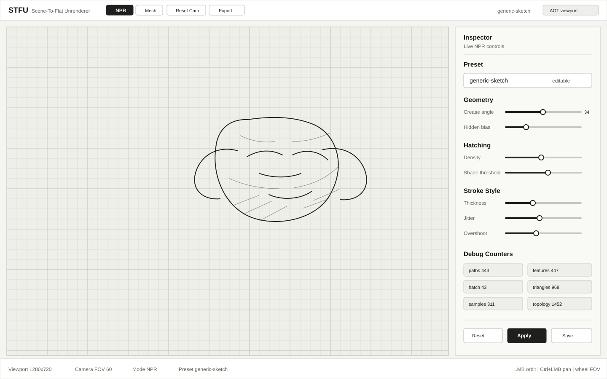

# Target UI Screen

This is the target working screen for the Avalonia UI.

The intended layout is:

- top command bar for render mode, reset, export, and active preset;
- main viewport for mesh/NPR rendering;
- right inspector panel for live NPR settings;
- debug counters for graph and stroke output;
- bottom status strip for viewport, camera, mode, and controls.

The inspector should edit the active `NprSettings` from `NprPresetRegistry`, then invalidate the viewport.
